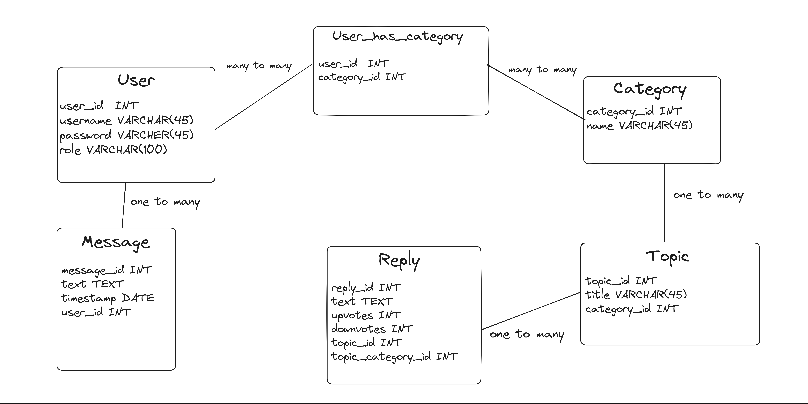

## Forum System API

### 1. Project description
1.1. Desinged and implemented a Forum System.

1.2. Provided a RESTful API that can be consumed by different clients.

1.3. High-level description:
- Users can read and create topics and message other users
- Administrators manage users, topics and categories

### 2. Database
**CHANGES TO FOLLOW**

### 3. Models
3.1. `User`: **CHANGES TO FOLLOW**

3.2. `Message`: **CHANGES TO FOLLOW**

3.3. `Category`: **CHANGES TO FOLLOW**

3.4.`Topic`: **CHANGES TO FOLLOW**

3.5.`Reply`: **CHANGES TO FOLLOW**

### 4. Endpoints
4.1. **Token** - **CHANGES TO FOLLOW**

4.2. **Register User** - **CHANGES TO FOLLOW**

4.3. **Create Topic** - **CHANGES TO FOLLOW**

4.4. **Create Reply** - **CHANGES TO FOLLOW**

4.5. **View Topics** - **CHANGES TO FOLLOW**

4.6. **View Topic** - **CHANGES TO FOLLOW**

4.7. **View Category** - **CHANGES TO FOLLOW**

4.8. **View Categories** - **CHANGES TO FOLLOW**

4.9. **Create Message** - **CHANGES TO FOLLOW**

4.10. **View Conversation** - **CHANGES TO FOLLOW**

4.11. **View Conversations** - **CHANGES TO FOLLOW**

4.12. **Upvote/Downvote a Reply** - **CHANGES TO FOLLOW**

4.13. **Choose Best Reply** - **CHANGES TO FOLLOW**

4.14. **Create Category** - **CHANGES TO FOLLOW**

4.15. **Make Category Private / Non-private** - **CHANGES TO FOLLOW**

4.16. **Give User a Category Read Access** - **CHANGES TO FOLLOW**

4.17. **Give User a Category Write Access** - **CHANGES TO FOLLOW**

4.18. **Revoke User Access** - **CHANGES TO FOLLOW**

4.19. **View Privileged Users** - **CHANGES TO FOLLOW**

4.20. **Lock Topic** - **CHANGES TO FOLLOW**

4.21. **Lock Category** - **CHANGES TO FOLLOW**

4.22. **Client** - **CHANGES TO FOLLOW**

### What to Include in the README:
- Project's Title: **DONE.** 
- Project Description
- Table of Contents (Optional)
- How to Install and Run the Project
- How to Use the Project
- Include Credit
- Add a License?
- Badges?