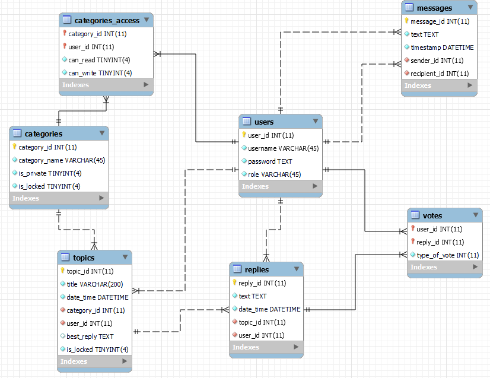

# Forum System API


## 1. Project description
- Desinged and implemented a Forum System.
- Provided a RESTful API that can be consumed by different clients.
- High-level description:
    - Users can read and create topics and message other users
    - Administrators manage users, topics and categories

## 2. Table of contents: describe what you will see during demonstration.


## 3. Database - relationships between tables


- User to Category – Many-to-Many: Multiple users can have read access to multiple categories, and each category can be accessed by multiple Users. And only admins can create a Category.
- User to Topic – One-to-many: A User can create multiple Topics, but one Topic is created by one user.
- User to Message – One-to-Many: A User can send multiple messages, but a message can belong to a single User.
- Replies to Users – One-to-Many:  A User can have many replies, but a Reply can belong to only one User.
- Category to Topic – One-to-many: A Category can have many Topics, but a Topic can be part of only one Category.
- Topic to Reply – One-to-many: A Topic can have multiple replies, but a single reply can only belong to one Topic.


## 4. Models
### 4.1. `User`model has the following attributes:
- id &rarr; int
- username &rarr; str
- password &rarr; str
- role &rarr; str

### 4.2. `Message` model has the following attributes:
- message_id &rarr; int 
- text &rarr; str
- timestamp &rarr; datetime
- sender_id &rarr; int
- recipient_id &rarr; int

### 4.3. `Category` model has the following attributes:
- category_id &rarr; int 
- category_name &rarr; str
- is_private &rarr;  int
    - in the schema, related column is is_private where 1 = private, 0 = public
- is_locked &rarr; int
    - in the schema, related column is is_locked where 1 = locked, 0 = unlocked

### 4.4.`Topic` model has the following attributes:
- topic_id &rarr; int 
- title &rarr; str
- date_time &rarr; datetime
- category_id &rarr; int
- user_id &rarr; int
- best_reply_id &rarr; str
- is_locked &rarr; str (allowed values: 'locked' or 'unlocked')
    - in the schema, related column is is_locked where 1 = locked, 0 = unlocked

### 4.5.`Reply` model has the following attributes:
- reply_id &rarr; int 
- text &rarr; str
- date_time &rarr; datetime
- topic_id &rarr; int
- user_id &rarr; int


## 5. Endpoints
### 5.1. User 
- ✔ GET /users: 
- DESCRIPTION: Responds with a list of user resources
    -`GET http://127.0.0.1:8000/users`
    responds with a list of all registered users
    -`GET http://127.0.0.1:8000/users/info`
    recieves the username and the role of the user
- ✔ POST / users
    - `POST http://127.0.0.1:8000/users/register`
    {
    "username": "Mike",
    "password": "1234"
    }
    - `POST http://127.0.0.1:8000/users/login`
    {
    "username": "Mike",
    "password": "1234"
    }
    -

### 5.2. Category
- ✔ GET /categories: 
    -`GET http://127.0.0.1:8000/categories`
    responds with a list of categories depending on the role and the privacy status
    -`GET http://127.0.0.1:8000/categories/name/Arts`
    responds the details of the category
- ✔ POST /topics:
    - `POST http://127.0.0.1:8000/categories/privace`
    changes the status of the privacy
    123
    - post dasdasdasdadadada

### 5.3. Message 

### 5.4. Topic
- ✔ GET /topics: 
    - DESCRIPTION: Responds with a list of Topic resources.
    - REQUEST: 
        - `GET http://127.0.0.1:8000/topics`
        - `GET http://127.0.0.1:8000/topics?search=sprint`
        - `GET http://127.0.0.1:8000/topics?sort=asc&sort_by=title`
        - `GET http://127.0.0.1:8000/topics?sort=desc&sort_by=date_time`
        - `GET http://127.0.0.1:8000/topics?search=sprint&sort=asc&sort_by=title`
        - `GET http://127.0.0.1:8000/topics?page=1&topics_per_page=3&search=f1`
    - RESPONSE: See Postman.

- ✔ GET /{topic_id}: 
    - DESCRIPTION: Responds with a single Topic resource and s list of Reply resources if there are any.
    - REQUEST:
        - `GET http://127.0.0.1:8000/topics/3` 
        - `GET http://127.0.0.1:8000/topics/4` 
    - RESPONSE: See Postman.
    
- ✔ POST /topics:
    - DESCRIPTION: Creates a new Topic.
    - REQUEST: `POST http://127.0.0.1:8000/topics` 
        ```json
        example 1: x-token => 3;MoSalah
        {
            "title": "F1 Miami GP Highlights",
            "category_id": 2,
            "is_locked": "unlocked"
        }
        example 2: x-token => 3;MoSalah
        {
            "title": "F1 Miami GP Breaking News",
            "category_id": 2,
            "is_locked": "unlocked"
        }
        ```
    - RESPONSE: See Postman.

- ✔ PUT /{topic_id}: 
    - DESCRIPTION: Updates a Topic resource with a best Reply resource.
    - REQUEST: `PUT http://127.0.0.1:8000/topics/4` -
        ```json
        example 1: x-token => 5;Eric
        {
            "best_reply": "Daniel Ricciardo P4 and points for the RB pilot.",
            "reply_id": "4"
        }
        example 2: x-token => 5;Eric
        {
            "best_reply": "Daniel Ricciardo P4 and points for the RB pilot.",
            "reply_id": "5"
        }
        ```
    - RESPONSE: See Postman.

- ✔ DELETE /topics: 
    - DESCRIPTION: Deletes a Topic resource and all of its Replies.
    - REQUEST: `DELETE http://127.0.0.1:8000/topics/6` x-token => 3;MoSalah
    - RESPONSE: See Postman.

### 5.5. Reply  
- ✔ POST /replies: 
    - DESCRIPTION: Creates a Reply data which is associated with a specific Topic.
    - REQUEST: `POST http://127.0.0.1:8000/replies` 
        ```json
        example: x-token => 3;MoSalah
        {
            "text": "Lando Norris won by a dominant 7.6-second margin.",
            "topic_id": 6
        }
        ```
    - RESPONSE: See Postman.

- ✔ PUT /replies/{id}: 
    - DESCRIPTION: Updates a Reply's text.
    - REQUEST: `PUT http://127.0.0.1:8000/replies/7` 
    ```json
    example: x-token => 3;MoSalah
        {
            "text": "Lando Norris won by a dominant 7.6-second margin over Max Verstappen's Redbull.",
            "topic_id": 5
        }
        ```
    - RESPONSE: See Postman.

- ✔ DELETE /replies/{id}: 
    - Description: Deletesa Reply.
    - REQUEST: `DELETE http://127.0.0.1:8000/replies/7` x-token => 3;MoSalah
    - RESPONSE: See Postman.

## 6. How to Install and Run the Project
- Navigate to /server and open a terminal
- Run `uvicorn main:app`
- Open a browser and type `http://127.0.0.1:8000/docs`. There should be documentation of the available endpoints.


### What to Include in the README:
- Project's Title: ✔ 
- Project Description: **IN PROGRESS**
- Table of Contents (Optional): **IN PROGRESS**
- How to Install and Run the Project: ✔ 
